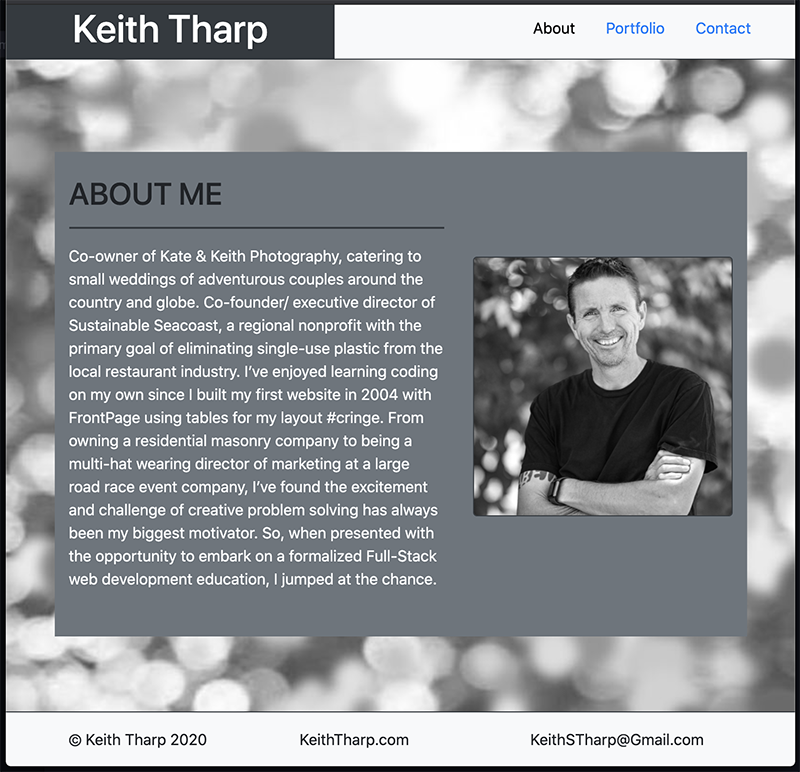
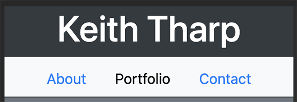

# 02 Bootstrap Responsive Portfolio
Creating a responsive, personal portfolio site using the Bootstrap CSS framework

View site here - https://keiththarp.github.io/02-Bootstrap-Responsive-Portfolio/

## Early Steps
The first few steps included getting the three HTML pages set up and saved along with a CSS file.

## Lessons From Working With Bootstrap
Initially I started out thinking I would use Bootstrap for the basics then create the site I wanted using my own CSS. After wrestling with the framework for several hours I decided to try working with the framework. That's when things got a lot easier.

**Nav Bar**
* I decided to work toward keeping a similar nav structure to that in the homework documentation rather than copying hamburger code from Bootstrap (avoiding the need for Bootstrap JS). Using the regular nav tools in Bootstrap and a small grid structure in the header, I was able to closely replicate the homework nav bar.

**About Me**
* I went with a slightly different layout here to present a better desktop version while still keeping a good looking mobile presentation.

**Portfolio**
* These are projects from my wedding photography business. I decided to use Bootstrap cards here for their clean presentation and flexible layout abilities in the grid.

**Contact**
* I went with a basic contact form here to match the homework documentation.

**CSS**
* This page went through a lot during the creation of this site. At one point when I was fighting the framework, there was a lot more code in here. Since the assignment was to put Bootstrap to work for us, I decided it was best to try to create a site I was happy with while using the least amount of excess CSS.

